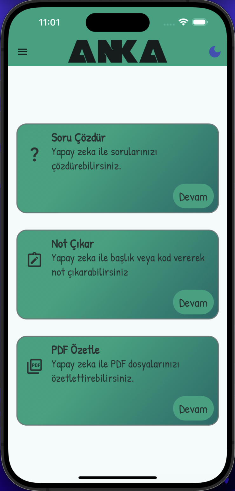
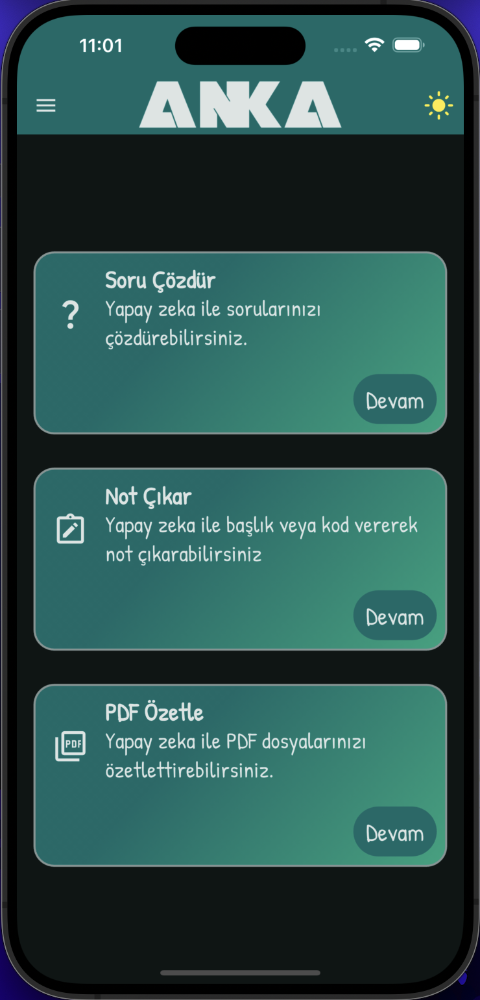

# BtkAkademi-Anka - Yapay Zeka Destekli Öğrenci Platformu

ANKA, yapay zekanın gücünü eğitimle buluşturan bir öğrenci platformudur. Google Gemini AI ile entegre çalışan bu sistem, öğrencilere her konuda yardımcı olan bir dijital asistan gibi hizmet verir. ANKA, web ve mobil uygulama olarak çoklu platform desteği sunarak öğrencilerin öğrenme süreçlerini daha verimli hale getirir.

Platform, öğrencilerin ders notları çıkarmasına, karmaşık konuları görsel zihin haritalarına dönüştürmesine ve her türlü içeriği kaydederek diledikleri zaman gözden geçirmesine olanak tanır. Matematik problemlerinden fen bilimleri sorularına kadar çeşitli soruları yapay zeka desteği ile çözebilir ve bu çözümleri tekrar incelemek üzere kaydedebilirler.

Uzun ya da kısa fark etmeksizin herhangi bir PDF dokümanını saniyeler içinde özetleyebilme özelliği sayesinde, öğrenciler bilgi kaynaklarını verimli bir şekilde analiz edebilirler.

Kullanıcı dostu arayüzümüz ile öğrenciler dijital içerikleri kolayca yönetebilir, istedikleri materyalleri diledikleri zaman tekrar gözden geçirebilirler. Hem web hem de mobil uygulama olarak erişilebilen ANKA ile eğitimde yeni bir deneyim sunuyoruz. Bilgiye ulaşımı kolaylaştırıyor ve öğrenmeyi daha anlaşılır bir hale getiriyoruz.

<p align="center">
  
  
</p>

## Özellikler
- **Google Gemini AI Destekli Soru Çözümü**: Matematik, fen bilimleri, tarih gibi çeşitli alanlardaki soruları çözebilme.
- **Görsel Zihin Haritası Oluşturma**: Karmaşık konular için görsel diyagramlar oluşturma.
- **PDF Analizi ve Özetleme**: PDF belgelerini analiz etme ve özetleme.
- **Çoklu Platform Desteği**: Web ve mobil platformlar için geliştirilmiştir.
- **Kullanıcı Dostu Arayüz**: Dijital içeriklerin kolayca yönetilmesine imkan tanır.
- **Kayıtlı İçerikler**: Öğrenciler, soru çözümlerini veya özetleri tekrar gözden geçirmek üzere platformda kaydedebilirler.

## Teknik Bilgiler
- **Web Uygulaması**: Django framework ile geliştirilmiştir.
- **Mobil Uygulama**: Flutter ile tasarlanmıştır ve kullanıcı doğrulama sistemi hariç tüm özellikleri hazırdır.
- **Veritabanı**: En kolay entegrasyon ve maliyetsiz kullanım için **PostgreSQL** önerilmektedir.
- **Kimlik Doğrulama**: JWT tabanlı kimlik doğrulama sistemi.

## REST API Servisi

ANKA platformunun tüm özelliklerini programatik olarak erişilebilir hale getiren REST API servisimiz, farklı platformlar için özelleştirilmiş çözümler üretmeyi ve mevcut sistemlere entegrasyon sağlamayı amaçlar.

### Temel API Özellikleri

- **JWT Tabanlı Kimlik Doğrulama**: Güvenli kimlik doğrulama için JWT sistemi kullanılmaktadır.
- **HTTPS Üzerinden Güvenli İletişim**
- **Google Gemini AI Entegrasyonu**: Akıllı diyagram oluşturma, görsel soru çözümü, PDF özetleme gibi özellikler.
- **Rate Limiting ve Hata Yönetimi**: Sağlam bir güvenlik ve hata yönetim sistemi.

### API Kullanımı

# ANKA REST API Servisi

REST API servisimiz, web uygulamamızda sunduğumuz tüm özellikleri farklı platformlarda kullanılabilir hale getiren bir API arayüzüdür. Bu API sayesinde, web platformumuzda bulunan soru çözme, PDF analizi ve yapay zeka destekli diyagram oluşturma gibi tüm işlevler programatik olarak kullanılabilir.

## API'nin Amacı ve Önemi

API servisimiz, platformumuzu daha erişilebilir ve esnek hale getirmek için tasarlanmıştır. Web arayüzünden yapılabilen her işlem, bu API aracılığıyla gerçekleştirilebilir. Böylece:

- Mobil uygulamalar geliştirilebilir
- Masaüstü uygulamaları oluşturulabilir
- Farklı platformlar için özelleştirilmiş çözümler üretilebilir
- Mevcut sistemlere entegrasyon sağlanabilir

## Temel Özellikler

### API Mimarisi ve Güvenlik
- RESTful mimari prensiplerine uygun tasarım
- JWT tabanlı güvenli kimlik doğrulama sistemi
- HTTPS üzerinden güvenli veri iletişimi

### Yapay Zeka Entegrasyonu
- Google Gemini AI destekli soru çözümleri
- Akıllı diyagram oluşturma
- PDF doküman analizi ve özetleme
- Görsel soru işleme ve cevaplama

## Teknik Detaylar

- JSON formatında veri alışverişi
- Bearer token authentication
- Kapsamlı hata yönetimi ve durum kodları
- Access ve refresh token sistemi
- Rate limiting ve güvenlik önlemleri

Bu API servisi, web platformumuzdaki tüm işlevselliği koruyarak, geliştiricilere kendi uygulamalarını oluşturma ve mevcut sistemlere entegre etme imkanı sunar.

# API Kullanımı

## Kimlik Doğrulama (Authentication)
### Giriş Yapma

```http
POST /api/login/
```

| Parametre  | Tip      | Açıklama                       |
| :--------- | :------- | :----------------------------- |
| `email`    | `string` | **Gerekli**. Kullanıcı emaili |
| `password` | `string` | **Gerekli**. Kullanıcı şifresi|

#### Başarılı Yanıt

```json
{
    "access": "access_token",
    "refresh": "refresh_token",
    "user": {
        "user_info": "kullanıcı_bilgileri"
    }
}
```

Access token, diğer tüm API isteklerinde Authorization başlığında Bearer token olarak kullanılmalıdır.

### Token Yenileme

```http
POST /api/token/refresh/
```

| Parametre  | Tip      | Açıklama                       |
| :--------- | :------- | :----------------------------- |
| `refresh`  | `string` | **Gerekli**. Refresh token    |

## Kullanıcı Profili

### Profil Bilgilerini Getir

```http
GET /api/profile/
```

| Header          | Tip      | Açıklama                               |
| :------------- | :------- | :------------------------------------- |
| `Authorization`| `string` | **Gerekli**. Bearer {access_token}    |

acces_token aracılığıyla ilgili kullanıcının profil bilgileri döndürülür.
## Sorular

### Soru Oluştur

```http
POST /api/question/
```

| Header          | Tip      | Açıklama                               |
| :------------- | :------- | :------------------------------------- |
| `Authorization`| `string` | **Gerekli**. Bearer {access_token}    |

| Parametre | Tip    | Açıklama                                    |
| :-------- | :----- | :------------------------------------------ |
| `foto`    | `file` | **Gerekli**. Resim dosyası (PNG/JPEG)      |

#### Başarılı Yanıt

```json
{
    "answer": "Gemini API yanıtı",
    "uploaded_image_url": "yüklenen_resim_url"
}
```

### Soruları Listele

```http
GET /api/questions/
```

| Header          | Tip      | Açıklama                               |
| :------------- | :------- | :------------------------------------- |
| `Authorization`| `string` | **Gerekli**. Bearer {access_token}    |

```json
liste
{
    "question_id": Soru id,
    "student_id": Ogrenci id,
    "image": Yüklenen sorunun adresi,
    "gemini_response": Gemini API yanıtı,
    "created_time": Oluşturulma Tarihi
},
```

### Soru Detayını Getir

```http
GET /api/questions/{question_id}/
```

| Header          | Tip      | Açıklama                               |
| :------------- | :------- | :------------------------------------- |
| `Authorization`| `string` | **Gerekli**. Bearer {access_token}    |

### Soru Sil

```http
DELETE /api/delete-question/{question_id}/
```

| Header          | Tip      | Açıklama                               |
| :------------- | :------- | :------------------------------------- |
| `Authorization`| `string` | **Gerekli**. Bearer {access_token}    |

## Mermaid Diyagramları

### Diyagram Oluştur

```http
POST /api/call_gemini/
```

| Header          | Tip      | Açıklama                               |
| :------------- | :------- | :------------------------------------- |
| `Authorization`| `string` | **Gerekli**. Bearer {access_token}    |

| Parametre    | Tip      | Açıklama                                  |
| :----------- | :------- | :---------------------------------------- |
| `prompt`     | `string` | **Gerekli**. Diyagram için metin prompt  |

#### Başarılı Yanıt

```json
{
    "mermaid_code": "oluşturulan_mermaid_kodu"
}
```

### Diyagramı Kaydet

```http
POST /api/save_diagram/
```

| Header          | Tip      | Açıklama                               |
| :------------- | :------- | :------------------------------------- |
| `Authorization`| `string` | **Gerekli**. Bearer {access_token}    |

| Parametre      | Tip      | Açıklama                                |
| :------------- | :------- | :-------------------------------------- |
| `mermaid_code` | `string` | **Gerekli**. Mermaid diyagram kodu     |
| `prompt_text`  | `string` | **Gerekli**. Orijinal prompt metni     |

#### Başarılı Yanıt

```json
{
    "success": "Mermaid kodu başarıyla kaydedildi."
}
```

### Kayıtlı Diyagramları Listele

```http
GET /api/list_diagrams/
```

| Header          | Tip      | Açıklama                               |
| :------------- | :------- | :------------------------------------- |
| `Authorization`| `string` | **Gerekli**. Bearer {access_token}    |

### Diyagram Sil

```http
DELETE /api/delete-mermaid/{history_id}/
```

| Header          | Tip      | Açıklama                               |
| :------------- | :------- | :------------------------------------- |
| `Authorization`| `string` | **Gerekli**. Bearer {access_token}    |

## PDF İşlemleri

### PDF Özetleme

```http
POST /api/summarize_pdf/
```

| Header          | Tip      | Açıklama                               |
| :------------- | :------- | :------------------------------------- |
| `Authorization`| `string` | **Gerekli**. Bearer {access_token}    |

| Parametre  | Tip    | Açıklama                              |
| :--------- | :----- | :------------------------------------ |
| `pdf_file` | `file` | **Gerekli**. Özetlenecek PDF dosyası |

#### Başarılı Yanıt

```json
{
    "summary": "PDF özet metni"
}
```

## Hata Yanıtları

### Genel Hata Yanıt Formatı

```json
{
    "detail": "Hata mesajı"
}
```

### Yaygın HTTP Durum Kodları

- 200: Başarılı
- 201: Oluşturuldu
- 400: Geçersiz İstek
- 401: Yetkisiz Erişim
- 404: Bulunamadı
- 500: Sunucu Hatası

## API Kullanım Örnekleri

### Giriş Yapma Örneği

```python
import requests

url = "API_URL/api/login/"
data = {
    "email": "kullanici@email.com",
    "password": "sifre123"
}

response = requests.post(url, json=data)
tokens = response.json()
access_token = tokens["access"]
```

### Authorization Header Kullanım Örneği

```python
headers = {
    "Authorization": f"Bearer {access_token}"
}
response = requests.get("API_URL/api/profile/", headers=headers)
```

### PDF Özetleme Örneği

```python
files = {
    'pdf_file': ('dosya.pdf', open('dosya.pdf', 'rb'), 'application/pdf')
}
response = requests.post(
    "API_URL/api/summarize_pdf/",
    headers=headers,
    files=files
)
```

### Soru Oluşturma Örneği

```python
files = {
    'foto': ('resim.jpg', open('resim.jpg', 'rb'), 'image/jpeg')
}
response = requests.post(
    "API_URL/api/question/",
    headers=headers,
    files=files
)
```

### Diyagram Oluşturma Örneği

```python
data = {
    "prompt": "Web uygulamasının çalışma akışını gösteren bir diyagram oluştur"
}
response = requests.post(
    "API_URL/api/call_gemini/",
    headers=headers,
    json=data
)
```

## Güvenlik Notları

1. Access token'lar güvenli bir şekilde saklanmalıdır
2. HTTPS kullanımı zorunludur
3. Token'ların süresi dolduğunda refresh token ile yenilenmelidir
4. Her istek için geçerli bir Authorization header'ı gönderilmelidir

## Sınırlamalar

1. Yüklenebilecek maksimum dosya boyutları:
   - Resimler: PNG/JPEG formatında
   - PDF dosyaları: PDF formatında
2. Access token geçerlilik süresi: 24 saat
3. Refresh token geçerlilik süresi: 7 gün
4. API istek limitleri uygulanabilir

